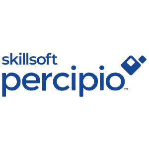
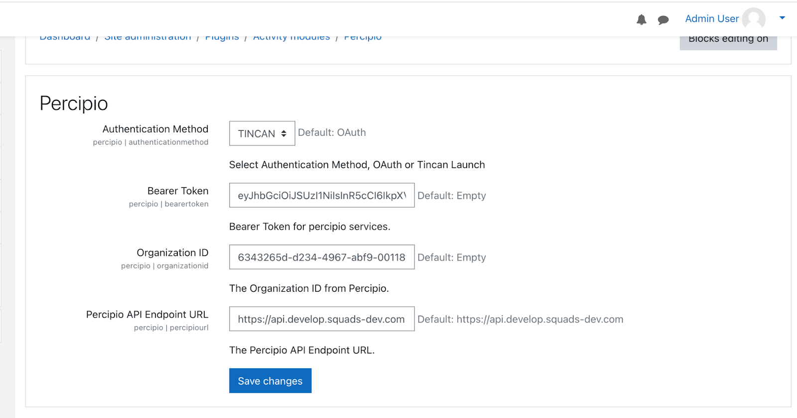
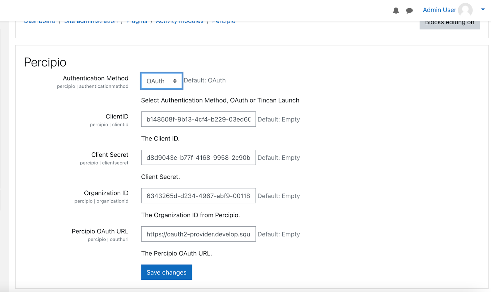
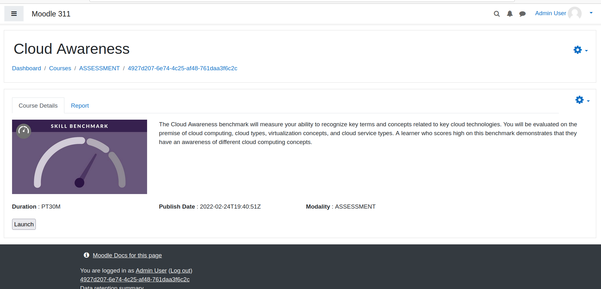
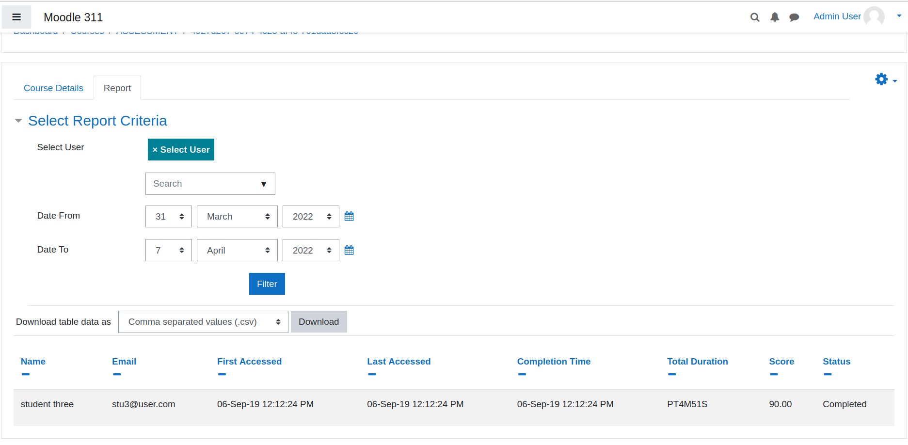

# Percipio - Activity Plugin

# Overview
This plugin has been developed to integrate Moodle and Percipio. It provides importing courses from Percipio into Moodle via API. It allows users to self enroll themselves into an imported Percipio course and then launch the Tin Can course from Moodle. Also, it consumes users' score/tracking information from Percipio w.r.t to a course.

This plugin has two API which facilitates the above functionalities. The API details are described below in the document.

# Plugin Type
Activity(Mod) Plugin

# Prerequisites
1.  Web service must be enabled in Moodle from Site Administration -> Advanced Features
2.  Rest protocol must be enabled from Site Administration -> Plugins -> Web services - Manage protocols
3.  Upload the zip and install the plugin from Site Administration -> Plugins -> Install plugins. Or manually you can unzip and copy the folder under the mod folder in your Moodle directory.
4.  Generate the token from Site administration -> Server -> Web services -> Manage tokens (select Admin user in the user’s drop-down and Percipio services in the Service drop-down)
5.  Complete the Percipio settings from Site administration -> Plugins -> Activity modules -> Percipio

# Functionality
1.  This plugin creates/updates single activity courses in Moodle via API call from Percipio and adds/updates a Percipio Activity inside the course. It checks whether the category sent in the API payload exists or not and creates them before creating the course.
2.  It enables self-enrolment sitewide(if not enabled) and adds the self-enrolment instance in the course so that users can self-enroll themselves. After enrolling, users can launch the Percipio content from Moodle.
3.  Once users complete the courses in Percipio, tracking information is sent to Moodle via API, and that tracking information is updated in Moodle.
4.  A scheduler task needs to be set in the Percipio w.r.t to token generated in Moodle. And Percipio will call the Moodle APIs accordingly.
    
# API Details
One can use the below payload to test the Moodle APIs from Postman.

## Course Import
**API Endpoint URL:** [your-moodle-url]/webservice/rest/server.php
**Method:** POST
**Payload:**
| Params | Value |
|--|--|
| wstoken | Token generated from Moodle |
| wsfunction | percipio_asset_import |
| moodlewsrestformat | json |
| data | ``{"fullname":"Cloud Awareness","shortname":"4927d207-6e74-4c25-af48-761daa3f6c2c","summaryformat":"1","summary":"The Cloud Awareness benchmark will measure your ability to recognize key terms and concepts related to key cloud technologies. You will be evaluated on the premise of cloud computing, cloud types, virtualization concepts, and cloud service types. A learner who scores high on this benchmark demonstrates that they have an awareness of different cloud computing concepts.","xapiActivityId":"https://xapi.percipio.com/xapi/assessment/4927d207-6e74-4c25-af48-761daa3f6c2c","format":"singleactivity","showgrades":"1","startdate":1645731651000,"visible":"1","groupmode":"0","defaultgroupingid":"0","enablecompletion":"1","completionnotify":"0","lang":"en-US","courseformatoptions":[{"name":"activitytype","value":"percipio"}],"category":"ASSESSMENT","percipiotype":"ASSESSMENT","displaylabel":"Skill BenchMark","link":"https://api.develop.squads-dev.com/cd/P0b9nvWEsQp","imageurl":"https://cdn2.percipio.com/public/c/public/images/skill-benchmark-image/modality/skill-benchmark-image.jpg","additionalMetadata":{"values":[{"name":"author","value":null,"customLabel":"Author","showDisplayLabel":true},{"name":"duration","value":"PT30M","customLabel":"Duration","showDisplayLabel":true},{"name":"expertise level","value":null,"customLabel":"Expertise Level","showDisplayLabel":true},{"name":"source","value":null,"customLabel":"Source","showDisplayLabel":true},{"name":"publish date","value":"2022-02-24T19:40:51Z","customLabel":"Publish Date","showDisplayLabel":true},{"name":"area","customLabel":"Area","showDisplayLabel":true},{"name":"subject","customLabel":"Subject","showDisplayLabel":true},{"name":"modality","value":"ASSESS","customLabel":"Modality","showDisplayLabel":true}],"settings":{"showOnSameLine":true,"showDisplayLabel":true}}}``|

**Sample Response:**
``
{
"moodlecourseid": 2,
"percipioid": "4927d207-6e74-4c25-af48-761daa3f6c2c",
"message": "Course updated successfully",
"code": 200
}
``

## Progress Tracking
**API Endpoint URL:** [your-moodle-url]/webservice/rest/server.php
**Method:** POST
**Payload:**
| Params | Value |
|--|--|
| wstoken | Token generated from Moodle |
| wsfunction | percipio_progress_tracking |
| moodlewsrestformat | json |
| data | ``{"username":"3","courseshortname":"4927d207-6e74-4c25-af48-761daa3f6c2c","completionstate":1,"completionmessage":"completed","finalgrade":90,"passingscore":80,"lastscore":70,"percentcomplete":"90","totalduration":"PT4M51S","timecreated":1567752144000,"timerevisited":1567752144000,"timecompleted":1567752144000,"timemodified": 1567752144897} ``|

**Sample Response:**
``
{
"message": "Success",
"code": 200
}
``

# Percipio settings
To get these credentials, one needs to contact Percipio Admin.

### 1. Using Tin Can

Percipio has a Service Account Token(bearer token) and Organization Id, which need to be added to the settings page after installing Percipio plugin.
The Plugin calls one Percipio API to get the content token dynamically and then using this content token, the user can launch a course in Percipio.

### 2. Using OAuth

OAuth is another authentication method used to give flexibility to Percipio customers, they can either choose Tin Can or OAuth.
In OAuth, client Id, client secret, and Percipio’s OAuth provider URL are needed, which is used to generate a bearer token and using this bearer token, a content token is generated to launch the content in Percipio.

# Screenshots

# License
2022 Skillsoft Ireland Limited - All rights reserved.

This program is free software: you can redistribute it and/or modify it under the terms of the GNU General Public License as published by the Free Software Foundation, either version 3 of the License, or (at your option) any later version.

This program is distributed in the hope that it will be useful, but WITHOUT ANY WARRANTY; without even the implied warranty of MERCHANTABILITY or FITNESS FOR A PARTICULAR PURPOSE. See the GNU General Public License for more details.

You should have received a copy of the GNU General Public License along with this program. If not, see http://www.gnu.org/licenses/.
